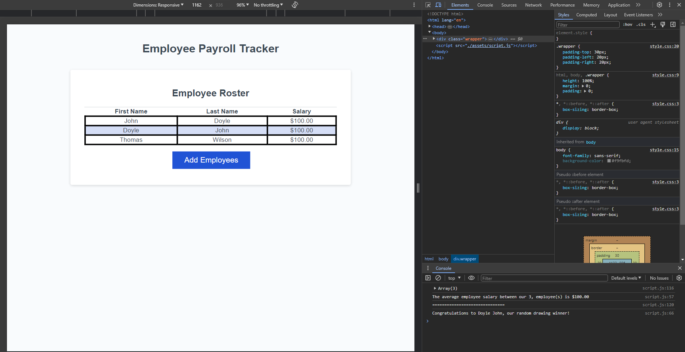

# Employee Payroll Tracker Starter Code
I really enjoyed troubleshooting all of my issues for this challenge. It was VERY frustrating at first trying to understand what was wrong with my code, but with all of the past chalenges under my belt; i was able to get closer and closer to understanding where the issues originated from. Also discovered just how useful console.log is since this was the only reason I was able to understand my issues. Overall, this is was a great learning experience because it gave me further understanding of javascript as well as refining my trouble shooting skills.
-------------------------------------------------------------

Link to deployed applicaiton: https://johntd796.github.io/Module3Challenge/
Screenshot of deployed application:

-------------------------------------------------------------

MIT License

Copyright (c) 2024 JohnTD796

Permission is hereby granted, free of charge, to any person obtaining a copy
of this software and associated documentation files (the "Software"), to deal
in the Software without restriction, including without limitation the rights
to use, copy, modify, merge, publish, distribute, sublicense, and/or sell
copies of the Software, and to permit persons to whom the Software is
furnished to do so, subject to the following conditions:

The above copyright notice and this permission notice shall be included in all
copies or substantial portions of the Software.

THE SOFTWARE IS PROVIDED "AS IS", WITHOUT WARRANTY OF ANY KIND, EXPRESS OR
IMPLIED, INCLUDING BUT NOT LIMITED TO THE WARRANTIES OF MERCHANTABILITY,
FITNESS FOR A PARTICULAR PURPOSE AND NONINFRINGEMENT. IN NO EVENT SHALL THE
AUTHORS OR COPYRIGHT HOLDERS BE LIABLE FOR ANY CLAIM, DAMAGES OR OTHER
LIABILITY, WHETHER IN AN ACTION OF CONTRACT, TORT OR OTHERWISE, ARISING FROM,
OUT OF OR IN CONNECTION WITH THE SOFTWARE OR THE USE OR OTHER DEALINGS IN THE
SOFTWARE.